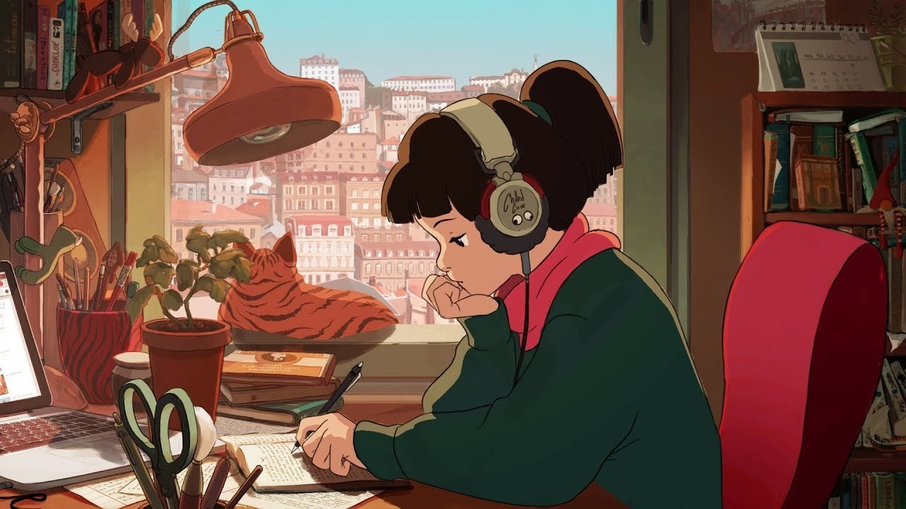

# CS 174 Final Project: Lofi Beats

### Creators:

* Ruben De La Torre
* Alejandro Rivas
* Jay Jay Phoemphoolsinchai

### Inspiration and Design:

With our animation we intend to simulate the passage of time for the average student. Amidst all the online schooling, it can often seem like the entire day passes you by without moving from your desk doing work. We plan to have a scene similar to that of the popular lofi girl with the outside transitioning from day to night as time passes. Furthermore, we chose to use lighting and illumination techniques learned throughout the Introduction to Computer Graphics course to show the time of day as well as using objects from tiny-graphics.

To interact with our animation, we added buttons from the tiny-graphics library to enable users to remove and return objects within the scene to get a better look at individual shadows. In addition, there are several other buttons that can switch the POV of the camera, set the sun to a certain time of day, and freeze/unfreeze time and movement of the sun.

### Advanced Feature:

The advanced feature we chose to implement is shadowing in which the shadows would adjust as the time of day changes. Objects such as books, cups, or a computer on the desk will cast shadows that adjust with the time of day. We implemented this functionality using shadow mapping which first renders a depth map to record the depth information in a texture from the light's perspective and then renders the scene as normal to determine which objects are in a shadow. In our implementation, we used a point light source which could be improved upon by instead using directional lighting which is typically how sunlight is portrayed.

### References

https://webglfundamentals.org/webgl/lessons/webgl-shadows.html

https://learnopengl.com/Advanced-Lighting/Shadows/Shadow-Mapping

